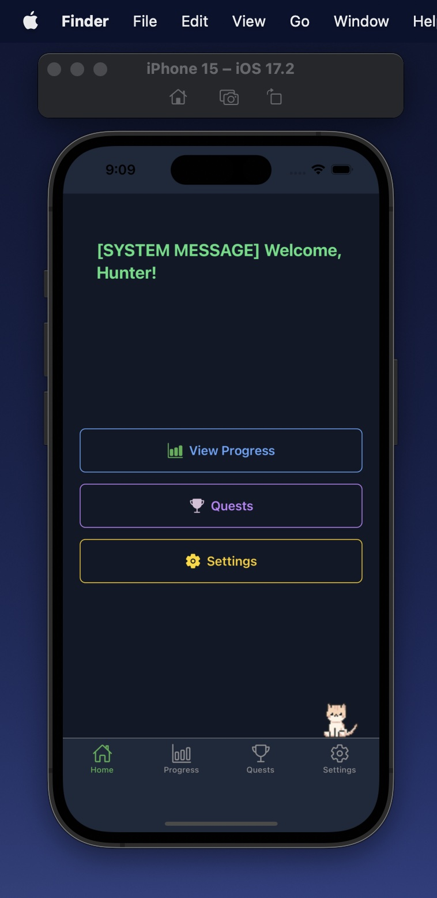

# LVLUP - Your Focus Companion  

LVLUP is a **Focus Companion** designed for **ADHD and neurodivergent users**. Complete tasks, gain XP, and level up your character as you progress – with **AI-assisted productivity** built in.  

  

The mobile app can be found in the `/expo` directory.  

## Why LVLUP?  

- **AI-powered assistance** – Smart suggestions, focus boosters, and automation to help you stay on track.  
- **Built for ADHD & neurodivergent minds** – Stay engaged with a gamified reward system.  
- **Minimal friction** – Simple, intuitive UI that keeps you focused on getting things done.  

## Inspiration  
LVLUP is inspired by [**Solo Leveling**](https://www.crunchyroll.com/series/GDKHZEJ0K/solo-leveling)

## License  
This project is licensed under the MIT License.  
